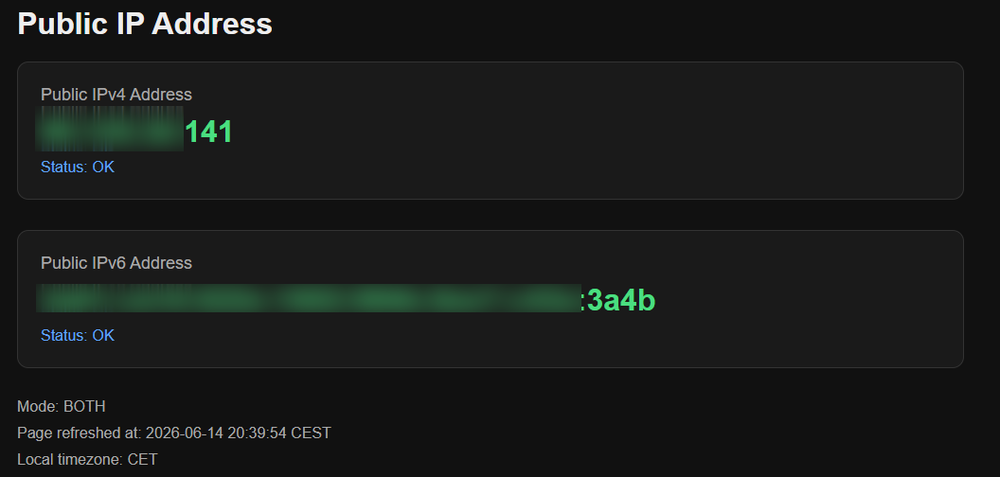

# WhatsMyIP Dual

A lightweight Docker container that displays the container's public IPv4 and/or IPv6 address via a simple web interface (also works with VPN projects such as Gluetun).

The page checks the public IP address on each refresh and displays the local refresh time.

⚠️ The container runs in host mode, which is why no port is specified for web access. However, it can be configured using environment variables (see below). ⚠️

<p align="center"></p>

## Features

- Display public IPv4 and/or IPv6 address

## Environment variables

| Variable | Default | Description |
|---|---:|---|
| `IP_MODE` | `both` | Choose which IP version to display |
| `PORT` | `3464` | Web server listening port |
| `TZ` | `UTC` | Local timezone used for the refresh time [(Zone List)](https://en.wikipedia.org/wiki/List_of_tz_database_time_zones) |

## IP_MODE values

| Value | Description |
|---|---|
| `both` | Display IPv4 and IPv6 |
| `ipv4` | Display IPv4 only |
| `ipv6` | Display IPv6 only |

## Docker compose version

```yaml
services:
  whatsmyip-dual:
    image: kalogire/whatsmyip-dual:latest
    container_name: whatsmyip-dual
    network_mode: host
    environment:
      - TZ=Europe/Paris
      - IP_MODE=both
      - PORT=3464
    restart: unless-stopped
```

## Docker run version

```yaml 
docker run -d --name whatsmyip-dual --network host -e TZ=Europe/Paris -e IP_MODE=both -e PORT=3464  kalogire/whatsmyip-dual:latest 
```
## Other examples of uses

- You can find examples of other uses (e.g., Gluetun) in the [examples folder](./examples).

## Trivy Security Scan Results

```yaml 
trivy image whatsmyip-dual:latest
2026-06-14T20:39:35+02:00       INFO    [vuln] Vulnerability scanning is enabled
2026-06-14T20:39:35+02:00       INFO    [secret] Secret scanning is enabled
2026-06-14T20:39:35+02:00       INFO    [secret] If your scanning is slow, please try '--scanners vuln' to disable secret scanning
2026-06-14T20:39:35+02:00       INFO    [secret] Please see https://trivy.dev/docs/v0.71/guide/scanner/secret#recommendation for faster secret detection
2026-06-14T20:39:35+02:00       INFO    Detected OS     family="alpine" version="3.24.0"
2026-06-14T20:39:35+02:00       WARN    This OS version is not on the EOL list  family="alpine" version="3.24"
2026-06-14T20:39:35+02:00       INFO    [alpine] Detecting vulnerabilities...   os_version="3.24" repository="3.24" pkg_num=47
2026-06-14T20:39:35+02:00       INFO    Number of language-specific files       num=0

Report Summary

┌───────────────────────────────────────┬────────┬─────────────────┬─────────┐
│                Target                 │  Type  │ Vulnerabilities │ Secrets │
├───────────────────────────────────────┼────────┼─────────────────┼─────────┤
│ whatsmyip-dual:latest (alpine 3.24.0) │ alpine │        0        │    -    │
└───────────────────────────────────────┴────────┴─────────────────┴─────────┘
Legend:
- '-': Not scanned
- '0': Clean (no security findings detected)
  
```
